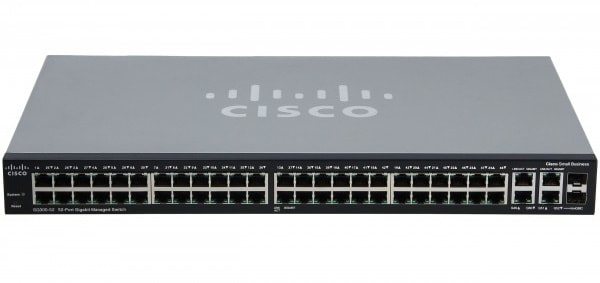

### Notes

Computers used to be standalone, there weren't able to share information with other devices.

Networking was created to share data between computers.

Services == Resources

* Network: A group of devices connected to share resources (hardware or software).

### Elements of Networking

* Client: any devices that request for resources or data

* Server: any devices that can provides resources.

* Network operating system (NOS): It is the system (software) operate on a network.

* Network Media: it is the path that data use to be transfer on the network. (It can be by wire or wireless).

* Network Interface Card (NIC)/Network Adapter/ Ethernet Card: It is a hardware used to connect with different devices

* Network Connectivity Device: It is used to connect devices and network.

Repeater: 

Router:

Switch:

Access point:

* Segment or Subnet: Segment or subnet are units of large bigger networks. Similar to breaker panels in a house.

**We ended the class talking about topology**